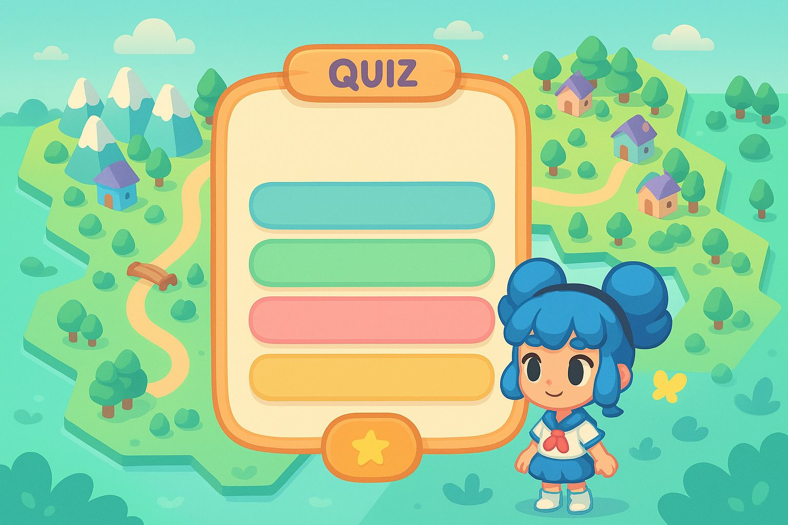

# 🎮 PPE_GAME - Jeu éducatif de quiz (Godot)

Bienvenue sur **PPE_GAME**, un jeu éducatif de quiz développé avec le moteur **Godot 4**.  
Ce projet a été réalisé dans le cadre du **Projet Personnel Encadré (PPE)** à l’ECE.

---

## 📚 Description

PPE_GAME est un petit jeu qui permet de tester ses connaissances en **culture générale** dans un monde ouvert. Le joueur est récompensé selon la **rapidité** et la **justesse** de ses réponses.

### Fonctionnalités :
- questions variées sur la culture générale
- Interface graphique **colorée et interactive**
- **Chronomètre** global pour répondre aux questions
- Calcul de score en fonction du **temps** de réponse
- Mode normal / difficile (score et timer adaptables)
- Musique d’ambiance 🎵
- Interface simple à prendre en main

---

## 🎮 Captures d’écran



---

## ⚙️ Technologies utilisées

- [Godot Engine 4.x](https://godotengine.org/)
- GDScript
- VS Code (pour l’édition de code)
- Git & GitHub (pour la gestion de version)
- Outils graphiques (illustrations, icônes)

---

## 📂 Organisation du projet

```bash
PPE_GAME/
│
├── scenes/             # Scènes Godot (quiz, menu, options...)
├── script/             # Scripts GDScript
├── src/picture/        # Ressources graphiques (boutons, fond...)
├── audio/              # Musique et sons
├── project.godot       # Fichier de configuration Godot
└── README.md           # Ce fichier
